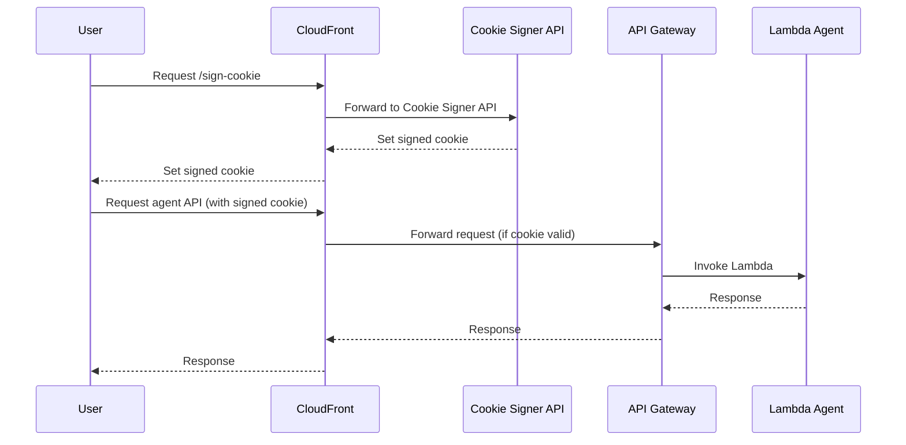

# Secure AI Agent

> **Motivation:** I am integrating an AI agent into my personal webpage, but I do not want to expose sensitive API keys in the frontend. By using CloudFront signed cookies, I can securely restrict access to the agent API, ensuring that API keys remain protected and are never exposed to users or other actors in the browser.

## Architecture



This project provisions a secure AWS infrastructure for an agent API using AWS CDK (TypeScript). It features CloudFront signed cookies, Lambda-based API endpoints, and automated key management.

## Features

- **AWS CDK Infrastructure**: Deploys Lambda, API Gateway, CloudFront, and Secrets Manager resources.
- **CloudFront Signed Cookies**: Restricts API access using signed cookies and CloudFront Key Groups.
- **Automated Key Management**: Scripts to generate, rotate, and update CloudFront public/private keys and manage secrets.
- **Environment-based Configuration**: Uses a `.env` file for key IDs and domain configuration.
- **Multiple Lambda Functions**: Includes both agent API and cookie signer Lambda functions for secure operations.

## Getting Started

### Prerequisites

- Node.js & Yarn
- AWS CLI configured with appropriate permissions
- AWS CDK v2

### Setup

1. **Install dependencies:**
   ```bash
   yarn install
   ```
2. **Configure environment:**
   - Copy `.env.example` to `.env` and set your values, or let the scripts manage it.

### Key Management

To generate and rotate CloudFront keys and update AWS Secrets Manager:

```bash
yarn keys:update
```

Or use the scripts directly:

```bash
./keys/generate-and-update-keys.ssh
./keys/add-cloudfront-public-key.sh
```

This will:

- Generate new private/public key pairs
- Store the private key in AWS Secrets Manager
- Create a new CloudFront public key and update `.env` with its ID
- Prompt you to deploy the stack

### Deploy Infrastructure

To build and deploy with the latest environment variables:

```bash
yarn deploy
```

## Scripts

- `yarn build` – Compile TypeScript
- `yarn build:lambda` – Compile Lambda functions in both `lambda/agent` and `lambda/cookie-signer`
- `yarn keys:update` – Generate and rotate CloudFront keys
- `yarn deploy` – Build and deploy with environment variables from `.env`

## File Structure

- `stacks/` – CDK stack definitions
- `lambda/agent/` – Lambda function for the agent API
- `lambda/cookie-signer/` – Lambda function for signing CloudFront cookies
- `keys/` – Key management scripts:
  - `add-cloudfront-public-key.sh` – Add a new CloudFront public key
  - `generate-and-update-keys.ssh` – Generate and rotate CloudFront keys
- `bin/` – CDK app entry point (`deploy.ts`)
- `.env` – Environment variables for deployment

## Security

- Private keys are never committed; they are stored in AWS Secrets Manager.
- CloudFront public keys are managed via AWS CLI and referenced by ID.

## Notes

- Always run `yarn keys:update` before `yarn deploy` when rotating keys.
- Ensure your AWS credentials allow CloudFront and Secrets Manager operations.

---

MIT License
